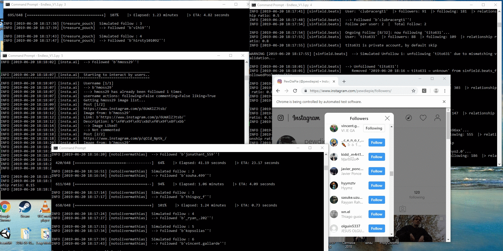
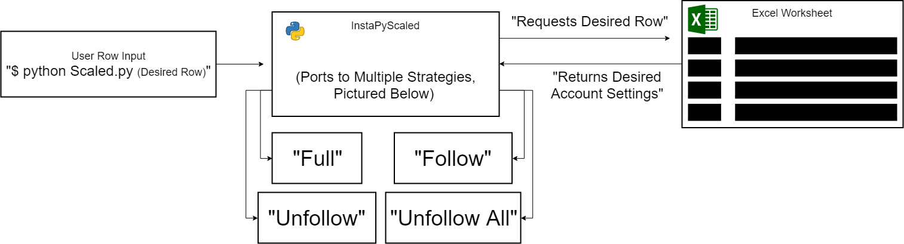
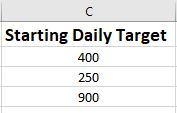
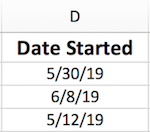
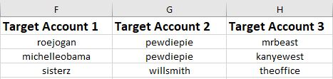
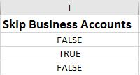
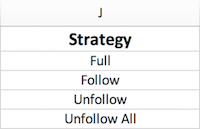
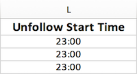

# InstaPyScaled
An Implementation of Tim Grossman's InstaPy That Simplifies Growth, and Tracking of Multiple Accounts Simultaneously

<a href="https://github.com/SeleniumHQ/selenium">
      
    </a>
    <a href="https://www.python.org/">
    	
    </a>
    <a href="https://www.python.org/">
      
    </a>

## General info
This implementation of [InstaPy](https://github.com/timgrossmann/InstaPy) by Tim Grossman improves users' abilities to grow multiple Instagram accounts simultaneously by creating a system where account growing strategies and algorithm choices are kept in a master database

## 🚩 Table of contents
* [General info](#general-info)
* [Problem](#problem)
* [Solution](#solution)
* [Flowchart](#flowchart)
* [Excel Variables](#excel-variables)
* [Dependencies](#dependencies)
* [Setup](#setup)
  * [Clone Repository](#clone-repository)
  * [Install InstaPyScaled Dependencies](#install-InstapyScaled-dependencies)
  * [Overwrite ChromeDriver](#overwrite-chromedriver)
  * [Run Scaled.py](#run-scaled.py)
* [Uses](#uses)
* [Acknowledgments](#acknowledgments)
* [InstaPy](#instapy)
* [License](#license)

## Problem
InstaPy is an amazing tool that allows people to grow their Instagram accounts orders of magnitude faster than normal. However, when trying to grow multiple accounts at once, a user's server or workstation can become incredibly crowded and disorganized.

With multiple instances running at once and it can be hard to modify code in between launches, test optimal configurations, and save successful settings in case of server crash or power outage.



## Solution
InstaPyScaled is a python program that uses InstaPy's methods and functions to create a scalable Instagram growth manager. Instead of taking commands directly from the terminal, this InstaPy script pulls information from a Microsoft Excel worksheet. Meaning that all your accounts' data is recorded and stored in one place, making a shift in strategies, start times, or analysis of effectiveness extremely simple.

This also allows for the 'cold storage' of InstaPy settings, meaning a frozen Digital Ocean server, or a power outage won't completely derail the growth of your Instagram Accounts.


## Flowchart

Running InstapyScaled is extremely simple, it only takes 1 argument, the row of the excel sheet that contains the account you want to start. This means that not only is it easy for humans to start multiple accounts quickly, it would be just as simple to write a bash script that starts InstaPy for your core accounts whenever your server/workstation is rebooted.



## Excel Variables

#### Insta Name & Password - String


The InstaPyScaled script pulls your account login information from these 2 columns, A & B. The 'Insta Name' and 'Insta Password' variables are fed directly into the Scaled.py program and used to log into Instagram with.

**Note**, make sure these columns are set to 'Text' or 'General' in the cell format settings so that the program reads them in as **Strings**.

#### Daily Target - Integer



The 'Starting Daily Target' variable in the excel sheet sets the maximum number of users InstaPy will attempt to follow in a single period. While there are hardcoded limits inside the code, they are defined by hourly follow, like, and unfollow numbers. The 'Starting Daily Target' variable is the only way to set the maximum number of Instagram accounts to interact with.

Also, to improve the follower outcome of this program, the 'Starting Daily Target' is increase by 30 each day. So try to set the 'Starting Daily Target' a bit lower for the first day to allow for growth and subsequent efficient unfollowing.

**Note**, there is currently no support from InstaPy for dynamic tallying of valid accounts processed. That is, when an account in the list is analyzed and skipped, for example, because settings specify NO BUSINESS ACCOUNTS, the number of accounts processed counting towards the 'Starting Daily Target' is still incremented.

#### Date Started - Date


This value is not actually read by the code, however, I find it useful to know when each strategy was started and the effects of running InstaPyScaled with those specific settings.

#### Target Accounts - String


The 3 'Target Account' columns allow the user to specify which accounts the InstaPy follow method should interact with. More specifically, the methods interact with these account's **followers**. In more detail, the code takes the 'Starting Daily Target' variable, floor-divides it by 3 and interacts with that number of followers of each 'Target Account'.

The exact actions taken by the program will be covered in the [Strategy](#strategy---string) section.

#### Days to Follow/Unfollow - Integer


This integer value is vital to the functioning of InstapyScaled and the default strategies themselves. It controls the number of days that each strategy runs.

#### Skip Business Accounts - Boolean


The 'Skip Business Accounts' variable is a boolean value that tells the program whether to skip accounts identified as Instagram business accounts during the interactions of accounts in the 'Full', and 'Follow' strategies.

**Note**, make sure the text in this excel column is either 'TRUE' or 'FALSE' in **ALL CAPS** ;)

#### Strategy - String


The 'Strategy' variable of InstaPyScaled contains information that the program uses to determine what actions to take with InstaPy. Included, are the following 4 strategies that I have been using to grown and maintain Instagram accounts. The next section will be a description of each strategy.

* ##### Full
The 'Full' strategy uses the other Excel settings to follow and like user's accounts, then unfollow them based on a 'FIFO' model (First In First Out), which allows ample time for users to follow back your account.

  More specifically, the 'Full' strategy follows the 'Starting Daily Target' number of followers of the accounts in the 'Target Accounts' variables starting at the 'Follow Start Time' variable. After following the target number that day, it waits until the next day and begins following the 'Starting Daily Target' amount + 30 at the 'Follow Start Time.'

  Once it has run for the all the days in the 'Days to Follow/Unfollow' variable, it sleeps for 24 hours and begins the unfollow process.

  In this process it takes the
  'Starting Daily Target' number, divided by 2, and unfollows that amount of followers from the accounts InstaPyScaled has previously followed starting at the specified 'Unfollow Start Time'.

 After following the target number that day, it waits until the next day and begins unfollowing the 'Starting Daily Target' amount, divided by 2, plus 30 at the 'Unfollow Start Time.'

 It continues this until it completes the number specified in the 'Days to Follow/Unfollow' variable.

 **Why is the 'Starting Daily Target' divided by 2?** We have found that only about 50% of the 'Starting Daily Target' number of accounts are followed because of the hardcoded settings. Therefore, we recommend that the 'Starting Daily Target' variable is about double your actual target value.

 **Note**, the 'Starting Daily Target' variable having 50% interaction may be down to personal InstaPyScaled settings and individual testing and customization is encouraged.


* ##### Follow

  The 'Follow' strategy attempts to follow the 'Starting Daily Target' number of followers of the accounts in the 'Target Accounts' variables starting at the 'Follow Start Time' variable. After attempting to follow the target number that day, it waits until the next day and begins following the 'Starting Daily Target' amount plus 30 at the 'Follow Start Time.'

  It continues this until it completes the number specified in the 'Days to Follow/Unfollow' variable.

  **Attempting** is used, again because we have found throughout testing that only about 50% of accounts make it through the optimized, hardcoded settings.

* ##### Unfollow
  The 'Unfollow' strategy takes the
  'Starting Daily Target' number, divided by 2, and unfollows that amount of followers from the accounts InstaPyScaled has previously followed starting at the specified 'Unfollow Start Time'.

  After following the target number that day, it waits until the next day and begins unfollowing the 'Starting Daily Target' amount, divided by 2, + 30 at the 'Unfollow Start Time.'

  It continues this until it completes the number specified in the 'Days to Follow/Unfollow' variable.

  This method reads in the hardcoded json file that it saved when you ran either the 'Full' or 'Follow' strategies. It it can't find the json list, it will attempt to find users InstaPy has followed through one of InstaPy's methods.

  **Note**, make sure you have followed users through InstaPy before using this strategy so that it has users to unfollow.

* ##### Unfollow All
  The 'Unfollow All' strategy takes the
  'Starting Daily Target' number, divided by 2, and unfollows that amount of followers from the accounts you are following starting at the 'Unfollow Start Time'.

  Then it waits until the 'Unfollow Start Time' during the next day and beings unfollowing the 'Starting Daily Target' number, divided by 2, plus 30.

  It continues this until it completes the number specified in the 'Days to Follow/Unfollow' variable.

  **Warning**, this strategy unfollows **EVERYONE**, it doesn't care who you are following, it will unfollow them to satisfy the
'Starting Daily Target' number of accounts it was told to unfollow.

**Note**, feel free to customize any of these strategies to best suit your needs or create completely new ones!

#### Follow Start Time - String


The 'Follow Start Time' variable allows users to set when the program begins its follow and like routine for the 'Follow' and 'Full' strategies. It is very important for account interaction to set the start time early enough that the users will open the Instagram follow/like notification, but not too early that they will still be sleeping.

**Make sure the 'Follow Start Time' cells are set to 'Text', not 'Time.'**

**Note**, make sure to take into account when the program will finish interacting with the 'Starting Daily Target' amount. Each 100 users added to the 'Starting Daily Target' variable takes ~1 hr to finish interacting with. Also, all times are in military time.

#### Unfollow Start Time - String


The 'Unfollow Start Time' variable allows users to set when the program begins its unfollow routine for all strategies. It is very important for follower preservation to set the start time late enough that the users will **NOT** open Instagram to see that you have unfollowed.

**Make sure the 'Unfollow Start Time' cells are set to 'Text', not 'Time.'**

**Note**, make sure to take into account when the program will finish interacting with the 'Starting Daily Target' amount. Each 100 users added to the 'Starting Daily Target' variable takes ~1 hr to finish interacting with. Also, all times are in military time.

#### Starting Followers/Followees - Integer


This is another section that doesn't actually get read by the code, however, I have found it helpful as a means of tracking the growth of my accounts before and after the use of InstaPy.


## Dependencies
**Note**,  all dependencies listed below Chrome Driver will be installed in the 2nd setup step below.
* [python 3.7](https://www.python.org/)
* [Microsoft Excel](https://products.office.com/en-us/excel) (or [Libre Office](https://www.libreoffice.org/))
* [Google Chrome 75.0.37](https://www.google.com/chrome/)
* [Chrome Driver 74.0.37](https://sites.google.com/a/chromium.org/chromedriver/)
* [schedule](https://pypi.org/project/schedule/)
* [glob](https://docs.python.org/2/library/glob.html)
* [openpyxl](https://openpyxl.readthedocs.io/en/stable/)
* [InstaPy](https://github.com/timgrossmann/InstaPy)


#### **Make sure to Download [Compatible](http://chromedriver.chromium.org/downloads/version-selection) Versions of Chrome Driver and Chrome**


## 💾 Setup
#### Clone Repository
Either download from a GUI or run the 'git clone' command on this url...
```
https://github.com/OliverMathias/InstaPyScaled
```

#### Install InstaPyScaled Dependencies
cd into the InstaPyScaled folder and run this command to install all dependencies at once...
```
$ pip3 install -r dependencies.txt
```

Or, install only the dependencies you need by running the pip install command...
```
$ pip3 install [package name]
```

#### Overwrite ChromeDriver
Make sure to copy your 'chromedriver' file into the InstaPyScaled folder so that you have to correct chromedriver for your machine...


#### Run Scaled
Finally, cd into the folder and run Scaled. The below command runs Scaled.py and selects the specific row which contains the account and settings information you want to pass InstaPy.

```
$ python3 Scaled.py [Row Number]
```

## Uses

also how you can run multiple settings of the same account on different lines

Obviously this implementation of a mass InstaPy scaler is best suited to my personal needs, and it's specific methods & settings are open to customization and additions. Again, feel free to add, subtract or build anything to make this work better for you.

If you need some ideas about how to customize this, I'd like to mention the value add possibility for A/B testing settings on the same account.

#### A/B Tester


InstaPyScaled offers a great way to A/B test multiple account settings in the same accounts to determine which combination of settings is the most efficient for that particular account.

The easiest way to do this is by adding the same login account information to different rows but changing specific settings. Then, by running and tracking InstaPy's effects on the account when each row is run, we can easily determine which settings are most effective.


## Acknowledgments
* [Tim Grossman](https://github.com/timgrossmann/)

## InstaPy
InstaPy is the core of this project and has been an amazing resource for my own research on growing Instagram accounts. If you have any questions about InstaPy you can find the github link [here](https://github.com/timgrossmann/InstaPy) and the extensive documentation can be found [here](https://github.com/timgrossmann/InstaPy/blob/master/DOCUMENTATION.md)

## 📜 License
This project is licensed under the GNU License - see the [LICENSE.md](LICENSE.md) file for details
